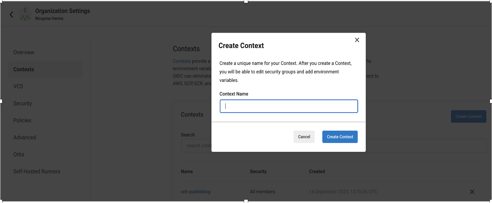
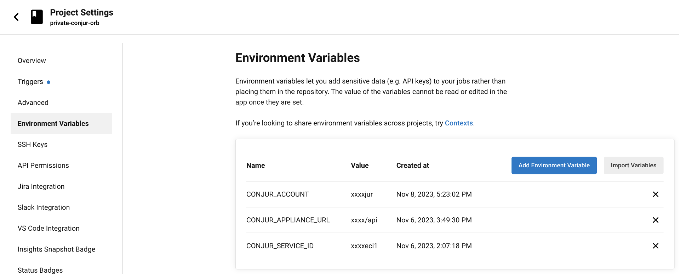
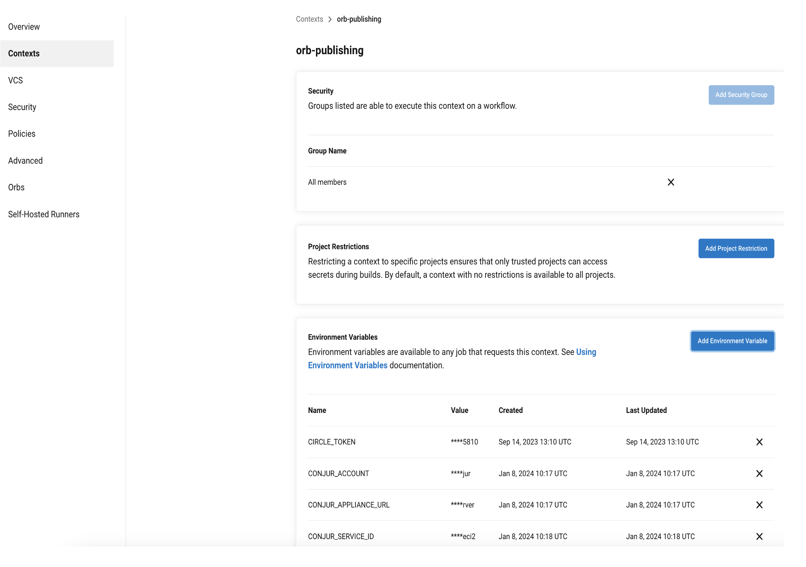
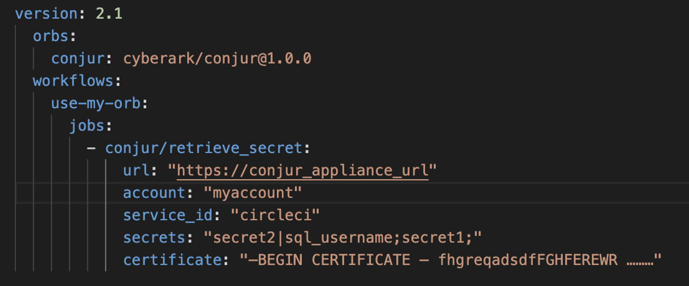

# Conjur-circleci-orb
The CircleCI Orb has the ability to obtain secrets from Conjur Server through the in-built environment variable OIDC token that is provided by the CircleCI pipeline for JWT authentication.


## Certification Level


This repo is a **Trusted** level project. It is supported by CyberArk and has been verified to work 
with Conjur Enterprise. For more detailed information on our certification levels, see [our community guidelines](https://github.com/cyberark/community/blob/main/Conjur/conventions/certification-levels.md#trusted).

## Features

The following features are available with the conjur-circleci-orb:

* Simplify and streamline the process to manage secrets while projects build in CircleCI pipeline.
* Enhance the security of CircleCI pipeline by integrating and leveraging the Conjur Secrets Management solution.
* Provide the ability for CircleCI pipeline to integrate with Conjur to retrieve secrets. 

## Limitations

*	CircleCI Conjur Orb does not support creating, deleting, or updating secrets.
*	CircleCI Conjur Orb doesn’t support below special char in secrets, using them result into unexpected secret value stored in environment variables:
     *	=
    *  `
	* ,
	* $followedbyanychar


## Technical Requirements

| Technology             | Version  |
| ---------------------- | -------- |
| Conjur OSS             | 1.9+     |
| Conjur Enterprise      | 12.5+    |
| Conjur Cloud           |          |

- Software Requirements

| Technology             | Version  |
| ---------------------- | -------- |
| Shell Scripting             | NA    |
| CircleCi Development kit| NA   |
| CircleCI CLI |       0.1.29   |


# Prerequisites

The following are prerequisites to use Conjur-circleci-orb.

## Circleci setup

1. Use CircleCI version 2.1 at the top of .circleci/config.yml file in the project
version: 2.1

2. Add the orbs stanza below your version, invoking the orb
orbs:
  conjur: cyberark/conjur@1.0.0

3. Use conjur elements in your existing workflows and jobs.

4. Setting Context for getting  pre-defined variable “CIRCLE_OIDC_TOKEN_V2” in CI/CD pipeline build > Organization Settings > Contexts.



5. Setting Conjur Authentication Configuration Parameter:

Required:
*	url or CONJUR_APPLIANCE_URL - the path to your Conjur instance endpoint. e.g. https://conjur.cyberark.com:8443
* account or CONJUR_ACCOUNT - the account configured for the Conjur instance during deployment.
* service_id or CONJUR_SERVICE_ID - the ID of Authn-JWT at Conjur
*	secrets - a semi-colon delimited list of secrets to fetch. 

Optional:

* certificate - if using a self-signed certificate, provide the contents for validated SSL.

Secrets Syntax for .circleci/config.yml file:

{{ conjurVariable1|envVarName1;conjurVariable2 }}

The secrets argument is a semi-colon (;) delimited list of secrets. Spaces are NOT SUPPORTED. The list can optionally contain the name to set for the environment variable.

Example:

db/sqlusername|sql_username;db/sql_password

In the above example, the first secret section is db/sqlusername|sql_username. The | separates the Conjur Variable ID from the environment variable that will contain the value of the Conjur Variable's value.
The second secret section is db/sql_password. When no name is given for the environment variable, the Conjur Variable Name will be used. In this example, the value would be set to SQL_PASSWORD as the environment variable name.

6. Setting environmental variables
* Adding/providing conjur parameter in CircleCi > Project Settings > Environment Variables.



* CircleCI > Organization Settings > Contexts > Select the context create at step 4 > Environment Variables.



* circle/config.yml with call to the conjur elements in workflows and jobs



## Conjur setup

Conjur (OSS or Enterprise or Cloud) and the Conjur CLI are installed in the environment and running in the background.

This section describes how to set up the JWT Authentication for Conjur Cloud

Pre-requisite:
- Conjur cloud
- Pcloud
- Conjur cloud cli

<small> <a href='https://docs.cyberark.com/conjur-cloud/latest/en/Content/HomeTilesLPs/LP-Tile1.htm?tocpath=Get%20started%7C_____0'>Refer the tutorial for Conjur Cloud Setup </a></small>
1. Manage Conjur Cloud users
2. Set up the Conjur Cloud CLI
3. Log in to Conjur Cloud
4. Sync Privilege Cloud Safe to Conjur

1. Define the JWT Authentication policy
-	Create a policy that defines the JWT Authentication, for example circleci.

```yaml
- !policy
  id: circleci
  body:
    - !webservice
  
    # Mandatory variable: How the JWT Authenticator gets the signing keys
    # Uncomment either 'jwks-uri' or 'public-keys
  
    - !variable jwks-uri
 
    # - !variable public-keys
 
    # Optional variables
    # Uncomment one or all of the following optional variables
    # Note: If you uncomment 'identity-path' you must also uncomment 'token-app-property'
    # Note: If you uncomment 'public-keys' above you must also uncomment 'issuer'
  
    #- !variable ca-cert
 
    - !variable token-app-property
   
    - !variable identity-path
  
    - !variable issuer
 
    - !variable audience
    
    # Group of applications that can authenticate using this JWT Authenticator
    - !group apps
  
    - !permit
      role: !group apps
      privilege: [ read, authenticate ]
      resource: !webservice
  
    - !webservice status
  
    # Group of users who can check the status of the JWT Authenticator
    - !group operators
  
    - !permit
      role: !group operators
      privilege: [ read ]
      resource: !webservice status
```

- Save the policy as authn-jwt-circleci.yml file:

```
     conjur policy load -f authn-jwt-circle.yml -b conjur/authn-jwt
```

- Set the secret and enable the authenticator.
```
conjur variable set -i conjur/authn-jwt/circleci/identity-path -v 'data/circleci-apps'

#### provide “CIRCLECI_ORG_ID"
conjur variable set -i conjur/authn-jwt/circleci/audience -v "<circleci_org_id>"  

#### provide "https://oidc.circleci.com/org/$CIRCLECI_ORG_ID"
conjur variable set -i conjur/authn-jwt/circleci/issuer -v "https://oidc.circleci.com/org/<circleci_org_id>"  

##### provide "https://oidc.circleci.com/org/$CIRCLECI_ORG_ID/.well-known/jwks-pub.json"
conjur variable set -i conjur/authn-jwt/circleci/jwks-uri -v "https://oidc.circleci.com/org/<circleci_org_id>/.well-known/jwks-pub.json"  

conjur variable set -i conjur/authn-jwt/circleci/token-app-property -v "oidc.circleci.com/project-id"

####Enable authenticator
conjur authenticator enable --id authn-jwt/circleci2

```

2. Define a workload (host) to represent your CircleCI job
- Create a policy that defines the host as below as circleci-host.yml file.

```
	- !policy
	  id: circleci-apps
	  body:
	      - !group
	      - &hosts
	        - !host
	          id: <id>  
	          annotations:
	            authn-jwt/circleci/sub:
	            authn/api-key: true
	      - !grant
	        role: !group
	        members: *hosts
```

- Load the host policy file into conjur

```
conjur policy load -f circleci-host.yml -b data
```

- Give your workload permission to authenticate to Conjur Cloud using the JWT Authenticator:

```
    - !grant
      roles:
        - !group apps
      members:
        - !group /data/circleci-apps
```

  save the above file as grant-app-access.yml and load it to conjur:

  ```
    conjur policy load -f grant-app-circle.yml -b conjur/authn-jwt/circleci
  ```

3. Workload access to secrets:

Provide the policy for grant the workload acces to the secrets and the CLI command for uploading the policy.

- Create a secrets file that contains the secrets to retrieve from Conjur.The file have the following format:
```
- !grant
  role: !group vault/my-secret-safe/delegation/consumers
  member: !group circleci-apps
```
- Save policy name as: circleci-secrets.yml and upate the policy.
```
conjur policy load -b data -f circleci-secrets.yml
```

## Contributing
We welcome contributions of all kinds to this repository. For instructions on how to get started and descriptions
of our development workflows, please see our [contributing guide](CONTRIBUTING.md).

## License
This repository is licensed under Apache License 2.0 - see [`LICENSE`](LICENSE) for more details.
